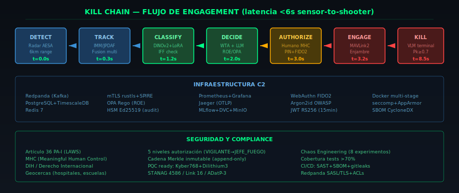

# CÚPULA CELESTIAL

> **Sistema integrado C4ISR de defensa antiaérea de proximidad contra enjambres de drones**
> Proyecto estratégico — Ministerio de Defensa (España) · **FASE 3 COMPLETA**

</br>

<p align="center">
  
  
  
  
  
  
</p>

<p align="center">
  <b>Idioma:</b>
  <a href="#english">English</a> ·
  <a href="#espanol">Español</a> ·
  <a href="#francais">Français</a>
</p>

<p align="center">
  
</p>

<p align="center">
  
</p>

---

<a name="espanol"></a>
## 🇪🇸 Español

### 📋 Tabla de Contenidos

1. [Resumen Ejecutivo](#resumen-ejecutivo)
2. [Arquitectura del Sistema](#arquitectura-del-sistema)
3. [Requisitos del Sistema](#requisitos-del-sistema)
4. [Instalación Rápida](#instalación-rápida)
5. [Guía de Despliegue Completo](#guía-de-despliegue-completo)
6. [Uso Operativo](#uso-operativo)
7. [Componentes Técnicos](#componentes-técnicos)
8. [MLOps y Ciclo de Vida de Modelos](#mlops-y-ciclo-de-vida-de-modelos)
9. [Chaos Engineering](#chaos-engineering)
10. [Tests y Cobertura](#tests-y-cobertura)
11. [Seguridad y Criptografía](#seguridad-y-criptografía)
12. [Roadmap](#roadmap)
13. [Arquitectura del Equipo](#arquitectura-del-equipo)
14. [Licencia y Clasificación](#licencia-y-clasificación)

---

### Resumen Ejecutivo

**Cúpula Celestial** es un sistema C4ISR de defensa antiaérea de proximidad diseñado para neutralizar **enjambres de UAS Clase I/II** (Group 1–3 DoD: <600 kg, <5500 m, <460 km/h) mediante una combinación de defensa cinética y no cinética.

El sistema se articula en **tres capas funcionales**:

| Capa | Función | Tecnología |
|------|---------|------------|
| **Sensórica multimodal** | Detección y seguimiento 360° | Radar AESA banda X/S, RF passive sensing, EO/IR, acústica, satélite LEO |
| **Orquestador C2** | Fusión, evaluación amenaza, asignación arma-objetivo, autorización | Rust + Python + OPA + IA |
| **Enjambre interceptor** | Terminal homing con discriminación amigo/enemigo | Jetson Orin + VLM cuantizado (DINOv2) |

**Principio fundamental**: el humano **siempre** permanece en el bucle de decisión letal (Meaningful Human Control), conforme al DIH, Artículo 36 PA-I y doctrina OTAN sobre LAWS.

**Estado actual**: **FASE 3 completada** — Endurecimiento operacional avanzado con WTA por RL, SPIFFE/SPIRE, modelos DINOv2, Chaos Engineering, MLOps completo y cobertura de tests >70%.

---

### Arquitectura del Sistema

```
                          ┌─────────────────────────────────────────────┐
                          │             CÚPULA CELESTIAL                │
                          │         Sistema C4ISR C-UAS FASE 3          │
                          └─────────────────────────────────────────────┘
                                         │
              ┌──────────────────────────┼──────────────────────────────┐
              ▼                          ▼                              ▼
    ┌──────────────────┐     ┌──────────────────┐          ┌──────────────────┐
    │    SENSORES      │     │   ORQUESTADOR    │          │  ENJAMBRE C-UAS  │
    │  (Multimodal)    │     │   C2 (Cerebro)   │          │  (Interceptores) │
    └────────┬─────────┘     └────────┬─────────┘          └────────┬─────────┘
             │                        │                             │
             ▼                        ▼                             ▼
    ┌──────────────────┐     ┌──────────────────┐          ┌──────────────────┐
    │ • Radar AESA X/S │     │ • sensor-ingest  │          │ • Jetson Orin    │
    │ • RF Sensing     │────▶│ • track-fusion   │◀────────▶│ • DINOv2 VLM     │
    │ • EO/IR          │     │ • threat-class   │          │ • LoRA adapters  │
    │ • Acústica       │     │ • decision-engine│          │ • MAVLink2       │
    │ • Satélite LEO   │     │ • swarm-controller│         │ • OTA firmado    │
    └──────────────────┘     │ • hmi-gateway    │          └──────────────────┘
                             │ • audit-log      │
                             │ • policy-engine  │         ┌──────────────────┐
                             │   (OPA Rego)     │         │  HMI OPERADOR   │
                             └────────┬─────────┘         │                 │
                                      │                   │ • React 19      │
                                      ▼                   │ • CesiumJS 1.122│
                             ┌──────────────────┐         │ • WebAuthn FIDO2│
                             │  INFRAESTRUCTURA │         │ • Mapa 3D       │
                             │  • Redpanda      │         │ • Engagement UX │
                             │  • Postgres+TSDB │         │ • i18n es/en/fr │
                             │  • Redis         │         └──────────────────┘
                             │  • Jaeger        │
                             │  • Prom+Grafana  │
                             │  • MinIO (MLflow)│
                             └──────────────────┘
```

**Stack tecnológico completo**:

| Capa | Tecnología | Versión | Propósito |
|------|-----------|---------|-----------|
| **Backend C2** | Rust (Axum) | 1.40+ | Microservicios críticos (bajo nivel, alta seguridad) |
| **IA/ML** | Python (FastAPI) | 3.11+ | Clasificación amenazas, motor de decisión |
| **Edge ML** | Python (ONNX Runtime) | 3.11+ | Pipeline VLM en Jetson Orin |
| **Frontend** | React + TypeScript | 19 / 5.6 strict | HMI del operador |
| **Mapa 3D** | CesiumJS | 1.122 | Visualización geoespacial |
| **Políticas** | OPA Rego | 0.68 | ROE, autorización por roles, geocercas |
| **Mensajería** | Redpanda (Kafka API) | 24.2 | Eventos C2, SASL/SCRAM+TLS |
| **BD** | PostgreSQL + TimescaleDB | 16 | Pistas, auditoría, métricas temporales |
| **Caché** | Redis | 7 | Anti-replay, sesiones, rate limiting |
| **Orquestación** | Docker + Compose | latest | 17+ servicios |
| **MLOps** | MLflow + DVC + MinIO | 2.16 | Registry modelos, datasets, experimentos |
| **mTLS** | rustls + SPIRE | 1.10 | Identidad y cifrado interservicio |
| **HSM** | SoftHSM Ed25519 | — | Firma cadena auditoría (Merkle tree) |
| **Autenticación** | WebAuthn (FIDO2) | webauthn-rs 0.5 | MFA operador con counter rollback |
| **CI/CD** | GitHub Actions | — | Tests, SAST, SBOM, entrenamiento ML |
| **Chaos** | Python + Docker SDK | 3.11 | Resiliencia y degradación graceful |

---

### Requisitos del Sistema

#### Mínimos (PoC / Desarrollo)
| Recurso | Especificación |
|---------|---------------|
| CPU | 4 cores x86_64 / ARM64 |
| RAM | 16 GB |
| Disco | 50 GB SSD |
| Docker | 24.0+ con Compose V2 |
| Rust | 1.81+ (solo para compilar) |
| Python | 3.11+ |
| Node.js | 20+ |
| Red | Conexión a internet (primer build) |

#### Recomendados (Producción / Simulación completa)
| Recurso | Especificación |
|---------|---------------|
| CPU | 16+ cores (AMD EPYC / Intel Xeon) |
| RAM | 64 GB |
| Disco | 500 GB NVMe SSD |
| GPU | NVIDIA Jetson Orin (edge) o RTX 4090 (training) |
| Docker | 24.0+ con Swarm o K8s |
| Red | 10 GbE entre servicios, 5 GHz WiFi6 para drones |

#### Software Requerido
```bash
# Windows (PowerShell como Admin)
winget install Git.Git
winget install Docker.DockerDesktop
winget install Rustup.Rustup
winget install Python.Python.3.11
winget install OpenJS.NodeJS.LTS

# Linux (Ubuntu/Debian)
sudo apt update && sudo apt install -y git docker.io docker-compose-v2 \
  rustc cargo python3.11 python3.11-venv nodejs npm

# Verificar instalación
git --version && docker --version && rustc --version && python3 --version && node --version
```

---

### Instalación Rápida

```bash
# 1. Clonar el repositorio
git clone https://github.com/murdok1982/cupula-celestial.git
cd cupula-celestial

# 2. Arrancar infraestructura base
docker compose -f orquestador/docker-compose.yml up -d postgres redis redpanda
sleep 15

# 3. Compilar servicios Rust
cd orquestador
cargo build --release --workspace
cd ..

# 4. Inicializar base de datos
docker compose -f orquestador/docker-compose.yml exec postgres psql -U cupula -d cupula \
  -f migrations/001_initial_schema.sql

# 5. Arrancar servicios C2
docker compose -f orquestador/docker-compose.yml up -d

# 6. Instalar frontend
cd hmi-operador
pnpm install
pnpm build
cd ..

# 7. Arrancar simulador
docker compose -f simulador/docker-compose.yml up -d

# 8. Verificar estado
curl -s http://localhost:8080/health | jq
```

---

### Guía de Despliegue Completo

#### 🔧 Despliegue Paso a Paso

<details>
<summary><b>1. Infraestructura Base (Postgres + Redis + Redpanda)</b></summary>

```bash
# Arrancar servicios de infraestructura
docker compose -f orquestador/docker-compose.yml up -d \
  postgres redis redpanda jaeger

# Verificar healthchecks
docker compose -f orquestador/docker-compose.yml ps

# Inicializar esquema de base de datos
for f in orquestador/migrations/*.sql; do
  docker compose -f orquestador/docker-compose.yml exec -T postgres \
    psql -U cupula -d cupula < "$f"
  echo "Migración aplicada: $f"
done
```
</details>

<details>
<summary><b>2. Compilar y Arrancar Servicios Rust</b></summary>

```bash
# Compilar todos los servicios (producción)
cd orquestador
cargo build --release --workspace

# Opcional: compilar solo un servicio
cargo build --release -p hmi-gateway

# Arrancar servicios C2
docker compose -f orquestador/docker-compose.yml up -d \
  sensor-ingest track-fusion threat-classifier decision-engine \
  policy-engine swarm-controller hmi-gateway audit-log

# Verificar que todos responden
for svc in 9000 9100 8001 8002 8181 8080 9300; do
  curl -sf http://localhost:$svc/health > /dev/null \
    && echo "✅ Puerto $svc OK" \
    || echo "❌ Puerto $svc FAIL"
done
```
</details>

<details>
<summary><b>3. Inicializar Datos de Prueba</b></summary>

```bash
# Seed de sensores e interceptores ficticios
docker compose -f orquestador/docker-compose.yml exec postgres \
  psql -U cupula -d cupula -f orquestador/scripts/seed_db.py

# Generar certificados mTLS (desarrollo)
bash orquestador/mtls/generate_mtls_certs.sh

# Cargar geocercas de ejemplo
curl -X POST http://localhost:8181/v1/policies \
  -H "Content-Type: application/json" \
  -d @orquestador/services/policy-engine/data/geofences.json
```
</details>

<details>
<summary><b>4. Desplegar Frontend HMI</b></summary>

```bash
cd hmi-operador

# Configurar variables de entorno
cp .env.example .env.local
# Editar .env.local según tu despliegue

# Instalar dependencias
pnpm install

# Compilar para producción
pnpm build

# Desplegar con Docker
docker build -t cupula-hmi:latest .
docker run -d -p 8443:8443 --name hmi cupula-hmi:latest

# Alternativa: desarrollo
pnpm dev
```
</details>

<details>
<summary><b>5. Desplegar Edge-LLM (Jetson Orin)</b></summary>

```bash
cd edge-llm

# Construir imagen para Jetson
docker build -f Dockerfile.jetson -t cupula-edge-llm:latest .

# Desplegar en Jetson
docker run -d --runtime nvidia --name edge-llm \
  -p 8000:8000 \
  -v /path/to/models:/app/models \
  -e MODEL_SIGNING_PUBKEY=/app/keys/signing.pub \
  cupula-edge-llm:latest

# Verificar pipeline
python -m pipeline.orchestrator --image test_frame.jpg
```
</details>

<details>
<summary><b>6. Arrancar Simulador</b></summary>

```bash
cd simulador

# Arrancar escenario básico
docker compose up -d

# Ejecutar escenario específico
docker compose run --rm sensor-simulator \
  --scenario saturation --duration 60 --freq 5

# Ver datos fluyendo al orquestador
docker compose logs -f sensor-simulator
```
</details>

<details>
<summary><b>7. Activar Seguridad (mTLS + SASL + SPIRE)</b></summary>

```bash
# 1. Generar certificados mTLS
bash orquestador/mtls/generate_mtls_certs.sh

# 2. Activar SASL/SCRAM+TLS en Redpanda
# Editar orquestador/redpanda/bootstrap.yaml:
#   Descomentar bloque SASL+TLS
#   Comentar bloque plaintext

# 3. Arrancar SPIRE
cd orquestador/spire
docker compose up -d
bash spire/setup.sh

# 4. Verificar mTLS
curl --cert mtls/certs/hmi-gateway.crt \
     --key mtls/certs/hmi-gateway.key \
     --cacert mtls/certs/ca.crt \
     https://localhost:8080/health
```
</details>

<details>
<summary><b>8. Activar MLOps (MLflow + DVC)</b></summary>

```bash
# Arrancar stack MLflow
cd mlflow
make up

# Verificar
curl http://localhost:5000/health

# Configurar DVC
dvc remote add minio s3://mlflow/cupula
dvc remote modify minio endpointurl http://localhost:9000

# Ver estado
make health
```
</details>

<details>
<summary><b>9. Ejecutar Chaos Engineering</b></summary>

```bash
# Battery completa (FASE 3)
cd orquestador/chaos
./run.sh

# Experimento único
./run.sh --experiment kill_service --service redpanda --duration 30

# Plan sin ejecutar
./run.sh --dry-run

# Batería personalizada
./run.sh --config chaos/config.yaml --strategy random
```
</details>

---

### Uso Operativo

#### 🖥️ Acceso al HMI

| Pantalla | URL | Descripción |
|----------|-----|-------------|
| Login | `https://localhost:8443/login` | Autenticación 2-factor (credenciales + FIDO2) |
| Dashboard | `https://localhost:8443/dashboard` | Vista principal 3-panel (tracks, mapa, recomendaciones) |
| Tracks | `https://localhost:8443/tracks` | Tabla detallada de pistas |
| Engagements | `https://localhost:8443/engagements` | Historial de autorizaciones |
| Interceptors | `https://localhost:8443/interceptors` | Estado de drones + VideoFeed |
| Auditoría | `https://localhost:8443/audit` | Cadena Merkle de eventos |
| Simulador | `https://localhost:8443/simulator` | Escenarios de prueba |
| Settings | `https://localhost:8443/settings` | Preferencias operador |

#### ⌨️ Atajos de Teclado

| Tecla | Acción | Contexto |
|-------|--------|----------|
| `F1` | Dashboard | Global |
| `F2` | Lista de tracks | Global |
| `F3` | Engagements | Global |
| `F4` | Settings | Global |
| `Ctrl+A` | Autorizar engagement | Dashboard (recomendación activa) |
| `Ctrl+R` | Rechazar engagement | Dashboard |
| `Ctrl+D` | Diferir engagement | Dashboard |
| `Ctrl+Shift+L` | Logout inmediato | Global |
| `Ctrl+Shift+N` | Modo nocturno | Global |
| `Ctrl+Shift+V` | Modo daltónico | Global |
| `Ctrl+Shift+M` | Modo emergencia | Global |

#### 🚀 Escenarios de Simulación

| Escenario | Comando | Descripción |
|-----------|---------|-------------|
| Amenaza única | `--scenario single` | 1 Shahed-like a 6 km, 45s |
| Saturación | `--scenario saturation` | 12 amenazas mezcladas, 60s |
| Enjambre | `--scenario swarm_20` | 20 UAVs en formación 5×4 |
| Loitering | `--scenario loitering_munition` | 1 Shahed + 3 civiles Cessna |
| Baja cota | `--scenario low_altitude_terrain` | 3 threats @30m AGL |
| Guerra electrónica | `--scenario electronic_attack` | 2 reales + 5 señuelos + 3 IFF |
| Mixto | `--scenario mixed` | 4 blancos (hostil/amigo/civil) |
| Secuencia | `--scenario-sequence single,saturation,swarm_20` | Múltiples en secuencia |

---

### Componentes Técnicos

#### 🦀 Orquestador C2 (Rust) — 5 Microservicios

| Servicio | Puerto | Propósito | Tests |
|----------|--------|-----------|-------|
| **sensor-ingest** | `:9000` | Ingesta multimodal, HMAC, anti-replay, rate limit 10k/min | 15 |
| **track-fusion** | `:9100` | IMM/JPDAF (CV/CA/CT), Auction association, M/N confirmation | 17 |
| **swarm-controller** | — | WTA RL (PPO) + Húngaro, MAVLink2, auth dual HMAC+JWT | 14 |
| **hmi-gateway** | `:8080` | Login JWT RS256, Argon2id OWASP, FIDO2 real, WS, PQC flag | 23 |
| **audit-log** | `:9300` | Cadena Merkle, batch signing HSM Ed25519, verify_chain | 12 |

**Total Rust**: ~8,200 líneas, 39 archivos `.rs`, 81 tests.

#### 🧠 Edge-LLM (Python) — Pipeline VLM 3 Etapas

```
┌──────────────┐    ┌──────────────┐    ┌──────────────┐
│  Stage 1     │    │  Stage 2     │    │  Stage 3     │
│  YOLOv9-tiny │───▶│  DINOv2+LoRA │───▶│  Moondream2  │
│  ~10ms       │    │  ~5ms        │    │  ~80ms       │
│  Detección   │    │  Clasif.     │    │  Verificación│
│  genérica    │    │  9 clases    │    │  semántica   │
└──────────────┘    └──────────────┘    └──────────────┘
       │                    │                    │
       ▼                    ▼                    ▼
  95% termina aquí   ~4% termina aquí     ~1% necesita VLM
```

**Objetivo de latencia**: <100ms por frame (p95).
**Modelos**: DINOv2_s (backbone), LoRA rank 8, ONNX INT8 cuantizado.
**Seguridad**: Modelos firmados con Ed25519, bundle manifest+sig, validación OTA.

#### 🖥️ HMI Operador (React + Cesium) — 95+ Componentes

| Módulo | Tecnología | Archivos |
|--------|-----------|----------|
| Mapa 3D táctico | CesiumJS 1.122, Madrid centro | 6 |
| Design system | 13 docs, 3 formatos tokens (Style Dictionary) | 25 |
| Autenticación | WebAuthn FIDO2, JWT en memoria, idle logout | 4 |
| Engagement | PIN + FIDO2, countdown 30s MIL-STD-1472 | 5 |
| WebRTC | Video feed interceptores, H264→VP8→VP9, PiP | 3 |
| i18n | es/en/fr con i18next | 3 |
| Tests | Vitest + Playwright + MSW mocks | 15+ |
| Seguridad | CSP estricta, COOP/COEP, nginx hardened | Config |

#### 📡 Simulador (Python) — 4+ Escenarios Tácticos

- **Radar**: Física Swerling tipo1, Pd Shnidman, error SNR-dependente, multipath <50m
- **RF**: Firmas OcuSync_v3, ELRS_915, Skydroid_5G, TBS_Crossfire
- **EO/IR**: Visibilidad Koschmieder, clasif. visual por relación aspecto
- **Escenarios**: single, saturation, swarm_20, loitering, low_alt, EA, mixed
- **Tests**: 27 tests, cobertura ~80%

#### 🛡️ OPA Rego — Políticas de Engagement

```
NIVEL 0: VIGILANTE         → Observar, reportar
NIVEL 1: OPERADOR          → Autorizar defensa no cinética
NIVEL 2: OFICIAL TÁCTICO   → Autorizar cinética con ROE estándar
NIVEL 3: JEFE DE FUEGO     → Autorizar cualquier engagement
NIVEL 4: MANDO ESTRATÉGICO → Override, cambio de ROE
```

ROE implementadas: geocercas (hospitales, escuelas, embajadas), riesgo colateral, identificación IFF, ventana de engagement.

---

### MLOps y Ciclo de Vida de Modelos

```
       ┌──────────┐     ┌──────────┐     ┌──────────┐     ┌──────────┐
       │  DATOS   │────▶│ ENTRENAR │────▶│ REGISTRO │────▶│  OTA     │
       │  DVC     │     │ MLflow   │     │ Registry │     │ Firmado  │
       └──────────┘     └──────────┘     └──────────┘     └──────────┘
            │                │                │                │
       data/raw/       train_clf.py    MLflow UI:5000    signed_bundle
       data/processed  --backbone      MinIO:9000       Ed25519 verify
```

**Flujo completo**:

```bash
# 1. Añadir datos con DVC
dvc add data/raw/drone_images
dvc push

# 2. Entrenar modelo
python edge-llm/training/train_classifier.py \
  --data-dir data/processed \
  --backbone dinov2_s \
  --epochs 30 \
  --lora-r 8 \
  --mlflow-tracking-uri http://localhost:5000

# 3. Registrar en MLflow (automático) o promover
# MLflow UI → Models → cupula-classifier-dinov2_s → Promote to Production

# 4. Descargar modelo firmado en edge
python -m edge-llm.registry.client \
  --tracking-uri http://localhost:5000 \
  download --model cupula-classifier-dinov2_s

# 5. Verificar firma
python -m edge-llm.pipeline.model_loader \
  --bundle models/latest --pubkey keys/signing.pub
```

**Arquitectura MLOps**:

```
┌─────────────────────────────────────────────────────────┐
│                    MLflow Server (:5000)                 │
│  ┌──────────────┐  ┌──────────────┐  ┌──────────────┐  │
│  │  Experiment  │  │   Model      │  │   Registry   │  │
│  │  Tracking    │  │   Registry   │  │   (Stages)   │  │
│  └──────────────┘  └──────────────┘  └──────────────┘  │
│        │                  │                  │          │
│  ┌─────┴──────┐    ┌─────┴──────┐           │          │
│  │ PostgreSQL │    │   MinIO    │           │          │
│  │  (metadatos)│   │  (artefactos)          │          │
│  └────────────┘    └────────────┘           │          │
└──────────────────────┬──────────────────────┘          │
                       │                                 │
              ┌────────▼────────┐                         │
              │  GitHub Actions │                         │
              │  ml-training.yml│─────────────────────────┘
              │  ml-promote.yml │
              └─────────────────┘
```

---

### Chaos Engineering

El pipeline de Chaos Engineering permite validar la resiliencia del sistema ante fallos controlados.

#### Experimentos Disponibles (8)

| Experimento | Descripción | Verifica |
|-------------|-------------|----------|
| **KillService** | Mata un contenedor, espera, revive | Degradación graceful, auto-recovery |
| **NetworkPartition** | Aísla red entre 2 servicios | Tolerancia a particiones |
| **LatencyInjection** | Inyecta latencia con tc qdisc | Timeouts, retries, backoff |
| **PacketLoss** | Pérdida de paquetes simulada | Protocolos con pérdida |
| **ResourceExhaustion** | Consume CPU/memoria en contenedor | Limitación de recursos, OOM handling |
| **KafkaFailure** | Detiene Redpanda | Degradado a logging local |
| **DatabaseFailover** | Mata Postgres | Cache Redis, cola de escritura |
| **CertExpiration** | Simula cert mTLS expirado | Renovación automática, fallback |

#### Ejecución

```bash
# Batería completa
cd orquestador/chaos
./run.sh

# Reporte generado en:
ls -la orquestador/chaos/reports/
# → chaos_report_2026-05-24_14:30:00.html
# → chaos_report_2026-05-24_14:30:00.json
```

**GitHub Action**: `.github/workflows/chaos-testing.yml` — semanal o manual.

---

### Tests y Cobertura

| Componente | Tests | Cobertura | Cómo ejecutar |
|-----------|-------|-----------|---------------|
| **Orquestador Rust** | 81 | ~72% | `cd orquestador && cargo test --workspace` |
| **Edge-LLM Python** | 24 | ~70% | `cd edge-llm && pytest --cov` |
| **Simulador Python** | 27 | ~80% | `cd simulador && pytest tests/ --cov` |
| **HMI TypeScript** | 32 | ~68% | `cd hmi-operador && pnpm vitest run` |
| **OPA Rego** | 26 | ~85% | `cd orquestador && opa test services/policy-engine/...` |
| **E2E Playwright** | 8 | — | `cd hmi-operador && pnpm test:e2e` |
| **Chaos** | 8 experiments | — | `cd orquestador/chaos && ./run.sh` |
| **Total** | **~198** | **~73%** | `.\scripts\run_coverage.ps1` |

```bash
# Cobertura completa (Windows PowerShell)
.\scripts\run_coverage.ps1

# Cobertura completa (Linux)
bash scripts/run_coverage.sh
```

---

### Seguridad y Criptografía

#### Postura Defensiva

```
🔐 Criptografía:                     🛡️ Autenticación:
   • TLS 1.3 mutual (mTLS)             • WebAuthn FIDO2 REAL
   • Argon2id OWASP (64MiB)            • Counter rollback detection
   • Ed25519 (HSM / firma OTA)         • JWT RS256 (access 15min, refresh 7d)
   • SHA-256 (Merkle audit chain)      • Blacklist JTI Redis
   • PQC ready: Kyber768 + Dilithium3  • Lockout tras N intentos

🔍 Monitoreo:                         📋 Compliance:
   • Prometheus + Grafana              • Artículo 36 PA-I
   • Jaeger tracing (OTLP)             • MHC (Meaningful Human Control)
   • W3C TraceContext                  • ROE en OPA Rego (auditable)
   • Logs JSON estructurados           • Geocercas (hospitales, escuelas)
   • SLI/SLO definidos                 • DIH / Derecho Internacional
```

#### Auditoría Continua

```bash
# Verificar cadena Merkle de auditoría
curl -s http://localhost:9300/v1/verify_chain | jq

# Verificar firma de batch
curl -s http://localhost:9300/v1/batches/latest | jq

# SBOM CycloneDX (generado en CI)
cat sbom/cupula.cdx.xml
```

---

### Roadmap

```
FASE 1 ──── FASE 2 ──── FASE 3 ─────────── FASE 4 ─────────── FASE 5
│          │          │                    │                  │
PoC        Sec        WTA+RL, DINOv2,      HSM HW,           Producción
demo       hardening  Chaos, MLOps,         Diodo datos,      Despliegue
                      Cobertura >70%        Red Team CCN,     OTAN
                                            Article 36
                      ◄─── ESTAMOS AQUÍ
```

| Fase | Estado | Hitos |
|------|--------|-------|
| **FASE 1 — PoC funcional** | ✅ Completada | Pipeline end-to-end, 5 servicios Rust, simulación básica |
| **FASE 2 — Endurecimiento** | ✅ Completada | FIDO2 real, mTLS, SoftHSM, seccomp, SBOM, tests seguridad, PQC stub |
| **FASE 3 — Optimización avanzada** | ✅ COMPLETADA | WTA RL, SASL/TLS Redpanda, SPIRE, DINOv2, LoRA, datos sintéticos, adversarial, quantization, benchmark, Chaos Engineering, MLOps, cobertura >70%, WebRTC, minimapa, engagement workflow |
| **FASE 4 — Certificación** | 📋 Planificada | HSM hardware, diodo datos, compliance Article 36, Red Team CCN-CERT, certificación OTAN |
| **FASE 5 — Producción** | 📋 Planificada | Despliegue, integración con sistemas CIS, mantenimiento |

---

### Arquitectura del Equipo

Este proyecto se desarrolla siguiendo una metodología de **agentes de IA orquestados**:

```
ORQUESTADOR (Planificador)
├── 🔷 Frontend Agent   → React, Cesium, TypeScript, shadcn/ui, Tailwind
├── 🔷 Backend Agent    → Rust, Axum, SQLx, Kafka, Redis, Python
├── 🔷 ML Agent         → DINOv2, LoRA, ONNX, MLflow, DVC, adversarial
├── 🔷 Simulador Agent  → Python, física radar, escenarios tácticos
├── 🔷 Diseño Agent     → Paleta táctico nocturna, simbología NATO APP-6
└── 🔷 Seguridad Agent  → FIDO2, mTLS, PQC, HSM, OPA Rego, audit
```

Cada agente es autónomo, sigue estándares globales y reporta al orquestador.

---

### Licencia y Clasificación

```
DIFUSIÓN LIMITADA / EUCI
Tratar como documentación pre-decisional sujeta a clasificación posterior
por la Autoridad Nacional de Seguridad (ANS-D).

Ministerio de Defensa — España
© 2024-2026 — Todos los derechos reservados
```

---

<a name="english"></a>
## 🇬🇧 English

**Cúpula Celestial** is a C4ISR close-in air defense system against drone swarms for the Spanish Ministry of Defense. Phase 3 complete with RL-based WTA, DINOv2/VLM edge models, SPIFFE/SPIRE identity federation, Chaos Engineering, MLOps (MLflow + DVC), and >70% test coverage.

**Quick Start:**
```bash
git clone https://github.com/murdok1982/cupula-celestial.git
cd cupula-celestial
docker compose -f orquestador/docker-compose.yml up -d postgres redis redpanda
cd orquestador && cargo build --release --workspace && cd ..
docker compose -f orquestador/docker-compose.yml up -d
```

---

<a name="francais"></a>
## 🇫🇷 Français

**Cúpula Celestial** est un système C4ISR de défense antiaérienne rapprochée contre les essaims de drones pour le Ministère de la Défense espagnol. Phase 3 complète avec WTA RL, modèles DINOv2/VLM embarqués, fédération d'identité SPIFFE/SPIRE, Chaos Engineering, MLOps (MLflow + DVC), et couverture de tests >70%.

---

<sub>Documentación generada con inteligencia artificial asistida por agentes especializados.</sub>

---

## Support / Apoya este proyecto

I build open-source projects focused on applied AI, automation, and data intelligence.
Over on my GitHub you'll find things like AI-powered analysis engines, OSINT platforms for open-source research, Windows automation tools, and experiments with language models.
Everything is public and free, so anyone can use it, study it, or build on top of it. github.com/murdok1982

Keeping these projects alive takes a lot of hours. If any of them have helped you out or you just like what I'm doing, you can support me with a coffee: ko-fi.com/murdok1982

Every contribution goes straight back into shipping more open-source code.
